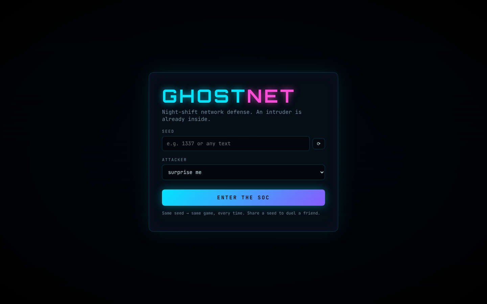
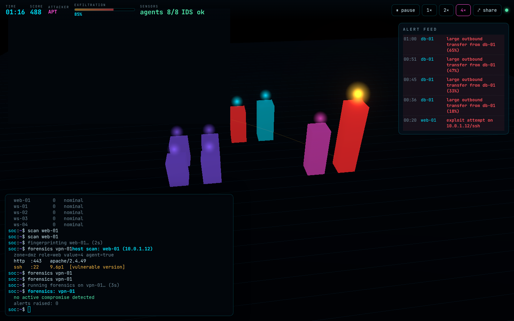

# GHOST NET

A 3D network-defense game. You are the night-shift analyst in a Security
Operations Center. An intruder is already inside a procedurally generated
company network, and an adaptive AI attacker is playing a real kill chain —
reconnaissance, initial access, lateral movement, persistence, sensor
sabotage, exfiltration. You defend from an integrated terminal while the
network breathes in front of you as a neon night city.

Everything runs inside a closed simulation. There is **no real network access,
no scanning, no offensive code** — attacks are events in a deterministic model.




## Highlights

- **3D attack visualisation.** Each host is a building, coloured by zone. A port
  scan is a radar sweep, a brute-force rattles the building, lateral movement
  sends an infection beam, exfiltration arcs a golden stream out to the
  attacker. Compromise glows red; the crown jewel glows gold.
- **Adaptive attacker.** A planner scores actions over an attack graph
  (cost, success probability, detection risk) and **replans** when you block a
  path. Three profiles: smash-and-grab, stealth, patient APT.
- **Fog of war.** You only see what your sensors report. The attacker can
  silence log agents and blind the IDS — and then you see nothing.
- **Deterministic & reproducible.** Same seed + same commands ⇒ the same game,
  tick for tick. Verified by replaying seeded games and comparing hashes.
- **Replay.** Rewind the whole incident and watch what the attacker did.
- **Incident report.** A full after-action report at game end (entry point,
  dwell time, attack chain, your mistakes, recommendations). Deterministic
  template by default; an LLM can enrich it if a key is configured — the
  template is the mandatory fallback, so the game never needs the internet.
- **Challenge mode.** Share a seed by URL (`?seed=1337&profile=apt`) to duel a
  friend on the exact same network.

## Prerequisites

- **Go ≥ 1.24**
- **Node ≥ 20** (22 recommended)
- `make`, and for linting `golangci-lint` (optional for just playing)

No external services are required to play.

## Run it (one command)

```bash
make dev
```

This builds the web client, builds the Go server, and serves the game at
**http://localhost:8080**. Open it, pick a seed, and enter the SOC.

> In a restricted sandbox where Go wants to auto-download a newer toolchain,
> prefix Go commands with `GOTOOLCHAIN=local` (or run `make dev` after
> `export GOTOOLCHAIN=local`).

During development you can instead run the client with hot reload against the
server:

```bash
make build-server && (cd server && ./ghostnet serve &)   # backend on :8080
cd web && npm install && npm run dev                      # Vite on :5173 (proxies /ws)
```

## Terminal commands

| Command | Effect |
|---------|--------|
| `help` | list commands |
| `status` | board overview (clock, score, per-host alert state) |
| `scan net` | enumerate the network (5s) |
| `scan <host>` | fingerprint one host's services and flaws (2s) |
| `logs [--tail] [host]` | recent sensor logs |
| `sensors` | sensor / IDS health |
| `forensics <host>` | investigate a host — reveals persistence (3s) |
| `isolate <host>` / `unisolate <host>` | cut a host off / reconnect it |
| `block <ip>` / `unblock <ip>` | drop / re-allow traffic from an IP |
| `patch <host> <service>` | harden a vulnerable service (4s) |
| `restart <host>` | reboot a host — clears a non-persistent foothold (3s) |
| `report` | after-action report (shown at game end) |

Every command has a cost and realistic side effects. Over-blocking your own
assets or reconnecting a still-compromised host costs you points.

The parser is hardened against hostile input: huge strings, control characters,
exotic unicode, ANSI-escape injection, missing/extra arguments, non-existent
hosts, and high-frequency spam are all handled gracefully.

## 2-minute demo script

1. `make dev`, open http://localhost:8080.
2. Seed `1337`, attacker **APT**, **ENTER THE SOC**.
3. `scan net` — see the layout. `scan web-01` — note a `[vulnerable version]`.
4. Watch the alert feed: a port scan, then `exploit attempt on web-01`. When
   `web-01` turns red, `forensics web-01` to confirm the compromise, then
   `isolate web-01` to cut the attacker's foothold.
5. The attacker replans toward another DMZ host — `patch` the service it's
   hammering, or `block` its source IP (from the alert).
6. If exfiltration from `db-01` starts climbing, `isolate db-01` fast.
7. Survive the shift (or evict the attacker) and read the incident report.
8. Hit **watch replay** and scrub the timeline to see the whole intrusion.

Prefer headless? `make demo` plays a seed to completion and prints the report;
`make replay-check` proves determinism across seeds.

## Project structure

```
server/   Go engine (deterministic, seeded), attacker AI, WS server, journal, report
web/      TypeScript + Vite + Three.js + xterm.js client
docs/     architecture, WS protocol, attack taxonomy, screenshots
```

See **[AGENTS.md](AGENTS.md)** for the full architecture, invariants and the
agent/CI harness, and **[docs/](docs/)** for design details.

## Quality gates

```bash
make verify        # lint + types + tests, both sides
make test-go       # Go unit tests with the race detector
make fuzz          # fuzz the command parser and the WS decoder
make replay-check  # determinism: identical hashes across replays
make e2e           # Playwright end-to-end against the real server
```

CI (GitHub Actions) runs lint, types, unit tests, a short fuzz pass, the seeded
replay check, and the end-to-end test on every push.

## Optional: LLM incident report

Set an API key (e.g. `ANTHROPIC_API_KEY`) before `make dev` to let the server
enrich the end-of-game report. Without a key, the deterministic template report
is used — identical gameplay, no network dependency.
